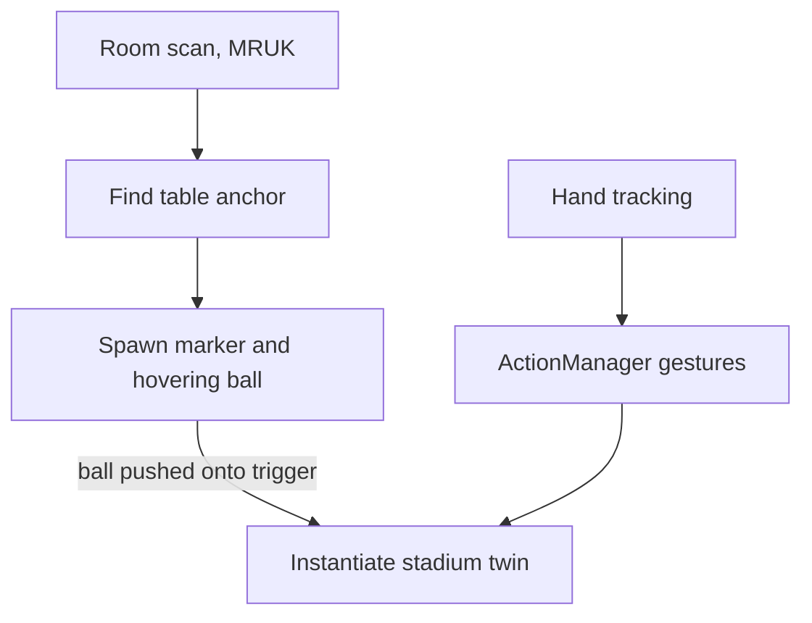

# Vision Arena

A mixed-reality stadium experience for Meta Quest. You drop a soccer ball onto your real table and a live digital twin of a match spawns on top of it, which you inspect and control with your hands. I built this during my Spatial Computing work at Globant (Sportian), reimagining what a VIP stadium seat could feel like when the field is sitting on the table in front of you.

## The idea

A stadium seat gives you one viewpoint. The bet here is that a headset can give you the whole field as an object you hold: a tabletop digital twin you can walk around, reach into, and re-angle, with the match playing out at miniature scale. The demo is set up around two clubs (Real Madrid and Atletico Madrid), a soccer pitch, and running player models, all placed on a real surface in your room.

## What it does

- Spawns the field on a real table using Meta's scene understanding, so the twin sits on an actual surface
- A "drop the ball" trigger: a hovering soccer ball, when pushed onto its target, plays a collision effect and instantiates the stadium twin in its place
- Hand-gesture interactions built on Meta's hand tracking: pinch-swipe left and right, a grab-and-pull, a thumbs-up, and an L shape for zoom
- Grabbable props (a bottle) that spring back to their home position when released
- Club branding, a top-view pitch, and cartoon VFX for feedback

## How it works

The project targets Quest through the Meta XR All-in-One SDK on Unity 6, with the Universal Render Pipeline. The interaction scripts sit on top of Meta's hand tracking and MR Utility Kit.

### Gesture recognition

Meta's SDK tells you when a pose like a pinch is happening. It does not tell you that the hand swiped. `ActionManager` builds directional gestures on top of the raw pose events by watching the hand transform over time. When a pinch starts it records the position and the clock, but a swipe only counts after the pinch has been held for half a second (`PINCH_VALIDATION_TIME`), and then only if the hand moves past a 0.15 unit threshold within a two-second window. The validation delay is the interesting part: without it, the small hand drift while your fingers are still closing into the pinch reads as a swipe, so the half-second hold is what makes the gesture deliberate. The same displacement-over-time idea drives the grab-pull on the z axis, the thumbs-up push, and the L-gesture zoom.

### Anchoring on a real table

`TableCenterSpawnPositions` uses MR Utility Kit to place the twin on real furniture instead of in mid-air. It registers a callback for when the room scan loads, filters the scene anchors down to ones labeled TABLE, takes each table's plane-rect center, and converts it to world space. Before spawning, it lifts the object by half its own height so it rests on the surface instead of clipping through, aligns rotation to the table's normal, and runs a `Physics.CheckBox` to skip spots where something already is. That is what makes the stadium feel like it is actually on your table and not floating near it.

### A note on multiplayer

The project is set up for shared sessions (Netcode for GameObjects, Unity Relay and Lobby, the multiplayer tools, and ParrelSync for testing several client instances from one machine), but the gameplay scripts in the repo are the single-user MR interaction pieces. I am flagging that honestly: the networking stack is wired into the project, the co-located multiplayer gameplay is not in this codebase.

## Tech stack

- Engine: Unity 6 (6000.0.36f1), Universal Render Pipeline
- XR: Meta XR All-in-One SDK 72, MR Utility Kit, Oculus hand interaction, Unity XR Management and the Oculus XR plugin
- Multiplayer (scaffolded): Netcode for GameObjects, Unity Relay, Lobby, and Multiplayer services, ParrelSync
- Assets and tools: UnityGLTF for glTF models, ProBuilder, Cartoon FX Remaster, AI Navigation

## Build notes

Open the project in Unity 6000.0.36f1, load `Assets/Scenes/Main.unity`, and build for Android with the Meta XR settings. It needs a Quest with hand tracking and a room configured in the headset's Space Setup, so MR Utility Kit has a table to find.

## Status

A Spatial Computing concept built at Globant (Sportian). Single-headset MR demo. The interaction and MR-anchoring systems are the built-out parts. The multiplayer layer is scaffolding.
