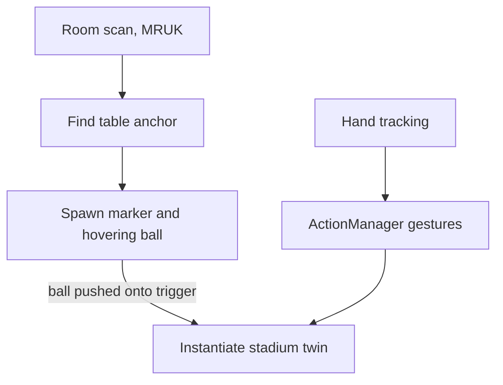

# Vision Arena

A mixed-reality stadium experience for Meta Quest. Drop a soccer ball onto your real table and a live digital twin of a match spawns on top of it. You then inspect and steer it with your hands. I built it during my Spatial Computing work at Globant (Sportian), chasing one idea: what a VIP stadium seat could feel like with the whole field sitting on the table in front of you.

## The idea

A stadium seat gives you one fixed viewpoint. The bet here is that a headset can hand you the whole field as an object you hold. A tabletop digital twin you can walk around, reach into, and re-angle, with the match playing out at miniature scale. The demo is built around two clubs (Real Madrid and Atletico Madrid), a soccer pitch, and running player models, all staged on a real surface in your room.

## What it does

- Spawns the field on a real table using Meta's scene understanding, so the twin sits on an actual surface
- A "drop the ball" trigger: a hovering soccer ball, when pushed onto its target, plays a collision effect and instantiates the stadium twin in its place
- Hand-gesture interactions built on Meta's hand tracking: pinch-swipe left and right, a grab-and-pull, a thumbs-up, and an L shape for zoom
- Grabbable props (a bottle) that spring back to their home position when released
- Club branding, a top-view pitch, and cartoon VFX for feedback

## How it works

The project targets Quest through the Meta XR All-in-One SDK on Unity 6, with the Universal Render Pipeline. The interaction scripts sit on top of Meta's hand tracking and MR Utility Kit.

### Gesture recognition

Meta's SDK tells you when a pose like a pinch is happening. It does not tell you the hand swiped. `ActionManager` fills that gap. It builds directional gestures by watching the hand transform move over time. When a pinch starts, it records the position and the clock. A swipe only counts once the pinch has been held for half a second (`PINCH_VALIDATION_TIME`), and then only if the hand travels past a 0.15 unit threshold inside a two-second window. That validation delay is the interesting part. While your fingers are still closing into the pinch, the hand drifts a little, and that drift reads as a swipe if you let it. The half-second hold is what makes the gesture deliberate. The same displacement-over-time trick drives the grab-pull on the z axis, the thumbs-up push, and the L-gesture zoom.

### Anchoring on a real table

`TableCenterSpawnPositions` uses MR Utility Kit to land the twin on real furniture. It registers a callback for when the room scan loads, then filters the scene anchors down to the ones labeled TABLE. For each table it takes the plane-rect center and converts it to world space. Before spawning, it lifts the object by half its own height so it rests on the surface cleanly, aligns rotation to the table's normal, and runs a `Physics.CheckBox` to skip spots that are already occupied. That last bit of care is what makes the stadium feel like it is genuinely sitting on your table.

### The ball drop

The "drop the ball" gesture runs on a little constrained-physics trick. `SpawnMarkerManager` pins the ball's x and z every frame, so you can only push it straight down, and it caps the height so the ball never rises above its resting spot. Push it past the trigger surface underneath and the twin spawns. Let go partway and it eases back up, climbing faster the farther it fell. The trigger is wired at runtime: on Start the manager adds a `TriggerCollisionDetector` to the surface and hands it the ball to watch.

### A note on multiplayer

The project is wired for shared sessions: Netcode for GameObjects, Unity Relay and Lobby, the multiplayer tools, and ParrelSync for running several client instances from one machine. The gameplay scripts here, though, are the single-user MR interaction pieces. So to be straight about scope: the networking stack is set up, and the co-located multiplayer gameplay has not been built into this codebase yet.

## Tech stack

- Engine: Unity 6 (6000.0.36f1), Universal Render Pipeline
- XR: Meta XR All-in-One SDK 72, MR Utility Kit, Oculus hand interaction, Unity XR Management and the Oculus XR plugin
- Multiplayer (scaffolded): Netcode for GameObjects, Unity Relay, Lobby, and Multiplayer services, ParrelSync
- Assets and tools: UnityGLTF for glTF models, ProBuilder, Cartoon FX Remaster, AI Navigation

## Build notes

Open the project in Unity 6000.0.36f1, load `Assets/Scenes/Main.unity`, and build for Android with the Meta XR settings. It needs a Quest with hand tracking and a room configured in the headset's Space Setup, so MR Utility Kit has a table to find.

## Status

A Spatial Computing concept built at Globant (Sportian). Single-headset MR demo. The interaction and MR-anchoring systems are the built-out parts. The multiplayer layer is scaffolding.
